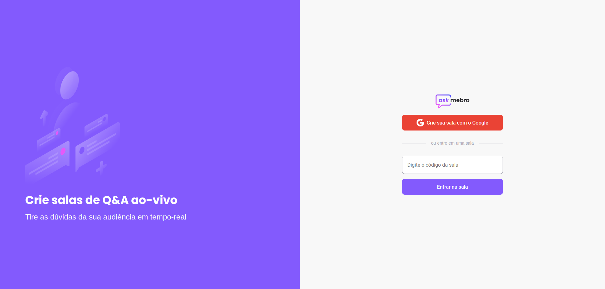
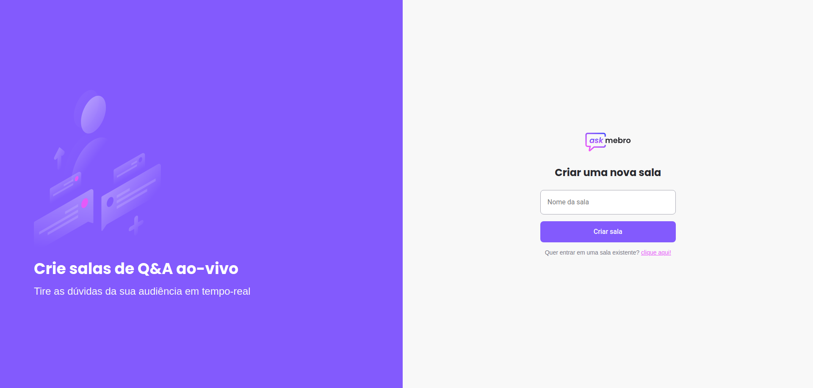
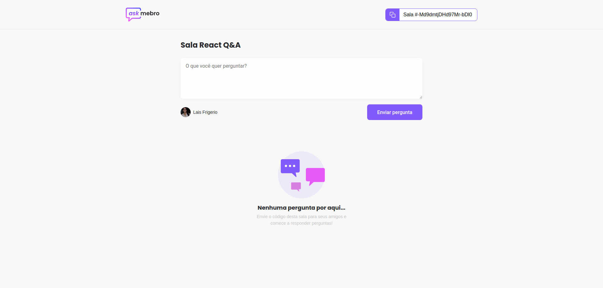
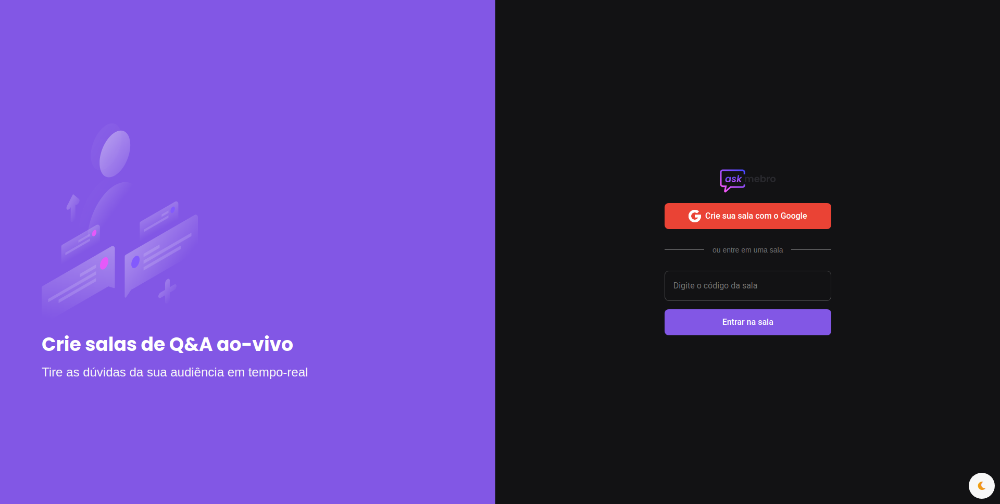
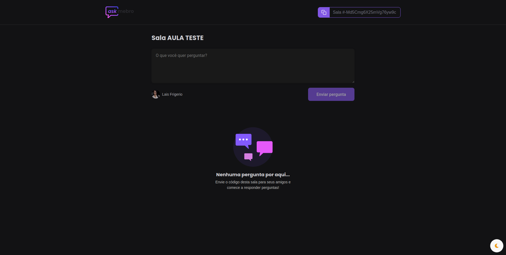
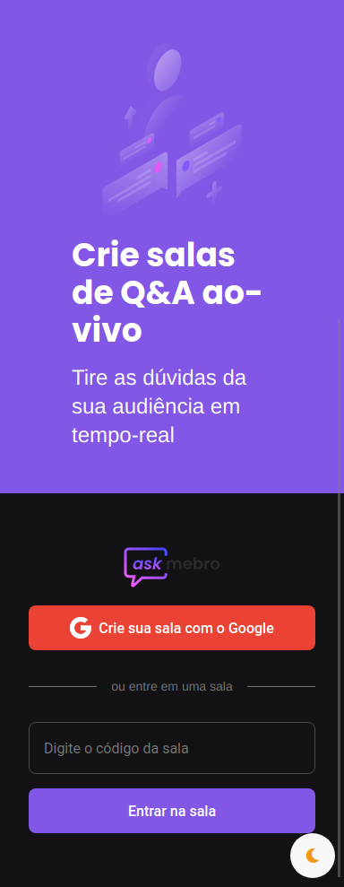
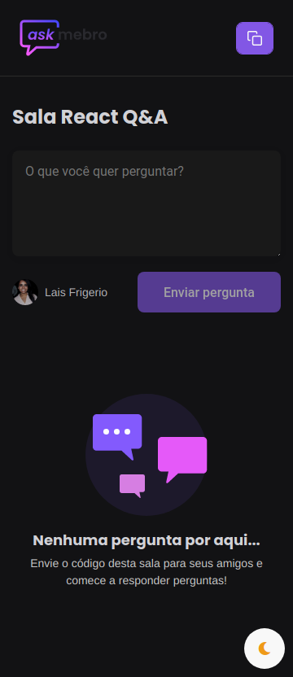
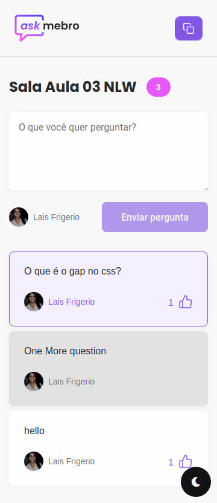

# Ask me Bro 💜

<p align="center">
  <a></a>
</p>

Toda pergunta tem uma resposta. Aprenda e compartilhe conhecimento com outras pessoas!!!

<p align="center">
  <a></a>
</p>

<p align="center">
  <a></a>
</p>

<p align="center">
  <a></a>
</p>

<p align="center">
  <a></a>
</p>

<p align="center">
  <a></a>
</p>

<p align="center">
  <a></a>
</p>

<p align="center">
  <a></a>
</p>

<p align="center">
  <a></a>
</p>

## 🛠️ Stack

- React, ContextApi to control state
- Typescript
- styled-components
- Firebase with Real time database
- Sign with Google (Firebase Authentication)
- Git flow
- Dark mode
- Responsive

## Layout

- [Figma](https://www.figma.com/file/i0zU1lwDNSBYSLjyTzmiuD/Letmeask-(Copy)?node-id=0%3A1)

## Run

```
    yarn install
    yarn statrt
```

## :woman: Author

[@laisfrigerio](https://github.com/laisfrigerio/)

## 📄 License

This project is licensed under the MIT License - see the LICENSE.md file for details